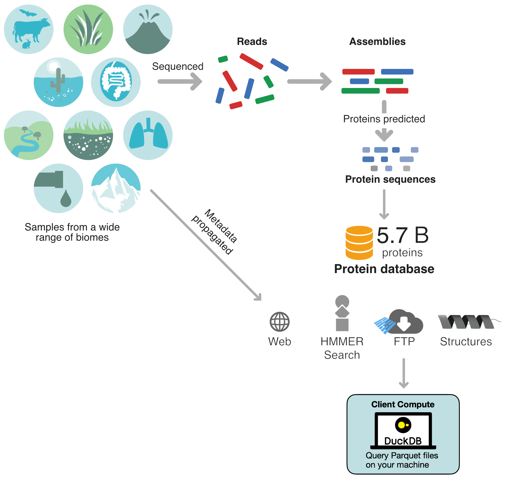

## Introduction {#sec-introduction}

{width=60%}

The MGnify Proteins database aggregates 5.7 billion non-redundant protein sequences from the outputs of the [MGnify Assembly Analysis Pipeline](https://www.ebi.ac.uk/metagenomics/pipelines/6#assembly). The database connects these sequences to the metadata of the assemblies and studies they originate from. These connections create a resource that can be exploited not only for its massive sequence space, but also for the insight it offers into how sequences relate to their biomes of origin, among other things.

In this practical, you will learn how to access the data for the latest MGnify Proteins release in three different ways. First, for a given sequence of interest, you will use the HMMER Web sequence search tool to retrieve sequences with similar sequence profiles. The resulting list of sequences can then be explored in detail using their respective protein detail pages. Finally, for programmatic access of MGnify Proteins, you will see how you can query the MGnify Proteins API, and four examples of how the Parquet files that make up the release can be queried using modern tools like DuckDB.

## MGnify Proteins website overview

First, go to the [MGnify Proteins website](https://www.ebi.ac.uk/metagenomics/proteins/), and let's look at its main page.

{width=100%}

Figure 1 shows the top part of the main page. There are two points of interest here:

- **A)** A text box that allows you to input a known MGYP accession.
- **B)** Information about the latest MGnify Proteins release.

### MGYP accessions {#sec-mgyp-accessions}

All non-redundant protein sequences within the database are accessioned as **MGYP**s. For example, `MGYP008002629865` corresponds to the unique sequence:

```fasta
>MGYP008002629865
MEYKVLLTVFAAVFIAELGDKTQLATMLFAADKEVSKLTVFIGASFA
LIAASGMGVLAGGFISQYMSERHLQLIAGIGFIAIGIWTLFKALTSG
```

:::: {.panel-tabset}

## Question
Would the same protein sequence appearing in two different assemblies have different MGYPs?

## Answer

**No, they would have the same MGYP.** Since an MGYP corresponds to a unique protein sequence, if that exact sequence appears in two or more different assemblies, it would bear the same accession within the MGnify Proteins database. That allows us to aggregate metadata about sources like assemblies for a given MGYP, which you will see in a later section.

::::

:::{.callout-note}
You can come back to **A\)** later on in the practical, once we have an MGYP of interest from running the HMMER sequence search.
:::

### Clustering of MGnify Proteins 

The latest release of MGnify Proteins is from July 2026, and so its release name is `2026_07`, which  consists of **5,739,566,171 MGYPs**. However, due to how ever increasing size of this database being unwieldly for many applications, we cluster the sequences based on sequence identity and coverage to significantly reduce the number of sequences. For the latest release, we generate two clusterings: **MGnify90** and **MGnify30**

#### MGnify90
We've clustered the sequences at 90% sequence identity and coverage using DIAMOND/linclust [-@buchfink2026clustering], which we call **MGnify90**. The MGnify Proteins website only displays the **MGnify90** cluster representatives, which is a smaller, but still substantial, subset of **1,661,142,385 MGYPs**, which is what can be seen in **B\)**. This clustering removes a lot of the high levels of sequence redundancy within the database.

#### MGnify30

**MGnify30** is the result of clustering the MGnify90 cluster representatives at 30% sequence identity and 80% coverage. However, on its own, the subset size is still too large to power applications like the HMMER sequence search. To that end, we filter MGnify30 down to three different subsets.

| MGnify30-C2 | MGnify30-C5-FL | MGnify30-C5-PPfam |
|-------------|----------------|-------------------|
| 128,674,267 | 20,911,652     | 18,155,509        |

##### Non-singletons (MGnify30-C2)
The non-singletons subset was created by extracting clusters that have **at least two members**, thereby excluding a majority of the representatives. This subset contains **128,674,267 cluster representatives**.

##### Larger non-singletons (MGnify30-C5-FL)
The larger non-singletons subset was created by extracting clusters that have **at least five members, including at least one member that is predicted to be a full-length sequence**. This subset therefore reduces the space even further, and guarantees at least one full-length sequence for increased confidence. This subset contains **20,911,652 cluster representatives**.

##### Pfam-poor non-singletons (MGnify30-C5-PPfam)
The Pfam-poor non-singletons subset was created by extracting clusters that have **at least five members, and where at least 90% of the cluster members do not have a Pfam accession**. This subset similarly reduces the space significantly, and contains clusters for which function is relatively unknown. This subset contains **18,155,509 cluster representatives**.

## HMMER sequence search

HMMER is an algorithm for performing searches against a target sequence database. On the MGnify Proteins website, it's possible to input a query sequence into the HMMER Web Service [-@rajkovic2026hmmer] to search for similar sequences in the MGnify30 clustering of the database.


### Running HMMER sequence search on MGnify30

![**Figure 2.** The bottom half of the MGnify Proteins website main page, with an input form for running HMMER sequence search on MGnify Proteins data. **A)** To run HMMER, input a query sequence for which you want to find similar hits within MGnify Proteins in this text box. An example input can be displayed by clicking on `example` above the text box. **B)** You can choose between three subsets of the MGnify30 clustering of the database here. **C)** You can modify some of the basic search parameters for HMMER here if necessary for your use case e.g. more strict searching criteria, although for most cases the default values should be fine.](images/mgnify_proteins_website_bottom.png){width=100%}

Figure 2 shows the bottom part of main page, and contains the form you can use to submit a HMMER sequence search job. The first part of the form - **A)** - is a textbox you can use you submit your query sequence. This input sequence will then be searched for in the chosen MGnify30 subset. The second part of the form - **B)** - is a dropdown menu you can use to select one of the three MGnify30 subsets described earlier in this practical. Finally, in the final part of the form - **C)** - some of the adjustable HMMER search parameters are displayed, and can be modified.

:::: {.panel-tabset}

## Question

The default HMMER search settings are good enough to get high homology hits, and should suit most cases. However, if you needed more stringent search results, what would be the easiest parameter to alter to achieve this, and how would you change it?

## Hint

If you have not worked with this kind of sequence tool before, the HMMER Web documentation for its thresholds can be found [here](https://hmmer-web-docs.readthedocs.io/en/latest/searches.html#thresholds).

## Answer

If you need more stringent search parameters for your use case, **lowering the E-value thresholds can help achieve this**. For example, you could set the sequence E-value to 0.00001 and the hit E-value to 0.00003. This change will result in a set of matches that are higher confidence due to the stricter E-value thresholds.
::::


For this part of the practical, we will work with this sequence:

```fasta
>O49499
MATTTTEATKTSSTNGEDQKQSQNLRHQEVGHKSLLQSDDLYQYILETSVYPRE
PESMKELREVTAKHPWNIMTTSADEGQFLNMLIKLVNAKNTMEIGVYTGYSLLA
TALALPEDGKILAMDVNRENYELGLPIIEKAGVAHKIDFREGPALPVLDEIVAD
EKNHGTYDFIFVDADKDNYINYHKRLIDLVKIGGVIGYDNTLWNGSVVAPPDAP
MRKYVRYYRDFVLELNKALAADPRIEICMLPVGDGITICRRIS
```

Specifically, this sequence is a methyltransferase enzyme with the Uniprot accession [O49499](https://www.uniprot.org/uniprotkb/O49499). Imagine this was your sequence of interest, and copy paste it into the textbox. We will keep the default database (**MGnify30-C2**) and parameters for this search. Once you've pasted the sequence into the textbox, click on the **Search** button.

:::{.callout-note}
We pasted the sequence in FASTA format, but you can also just paste the sequence as is without the `>` header.
:::

### Understanding HMMER results

After waiting about a minute, you will be redirected to a webpage containing the results of your search:

![**Figure 3.** The HMMER results page. **A)** This diagram displays the different Pfam matches found on the query sequence - in this case there is one with the name "Methyltransf_3". **B)** At the bottom of the results page, a table with all the matches can be found. For each matching MGYP, their source studies and assemblies, matched Pfam accessions, and the E-value of the match, can be found. **C)** More detail about a match can be found by clicking on the arrow here, including the full alignment.](images/mgnify_proteins_hmmer_results.png){width=100%}

The result page is organised into two major sections, with the first (**A**) containing a schematic describing which, if any, Pfam accessions were found on the query sequence. The schematic does not just visualise which Pfam accession are predicted on the sequence, but also the overall architecture in which those accessions are laid out i.e. the order and location of Pfams within the sequence. In this example, there is only one known Pfam accession: [PF01596](https://www.ebi.ac.uk/interpro/entry/pfam/PF01596/), which stands for `O-methyltransferase`. That Pfam matches what we know about our query sequence from its Uniprot entry, which makes sense!

Below the schematic, there is a paginated table containing all of the MGnify30 matches to the query sequence (**B**). For each matching MGYP i.e. the target sequence, we get their MGYP accessions, and metadata about the studies and assemblies those target MGYPs come from. We also get a list of Pfam accessions each target sequence has, and finally the E-value of the match.

:::: {.panel-tabset}

## Question

Given the results in table, which MGYP would you consider the best match to our query sequence, and why?

## Answer

The first MGYP in the table - `MGYP002778845309` - can be considered the best match. This is because the table is sorted in descending order by E-value, and the lower the E-value the higher confidence we have in the match.

::::


We can see some more details about this match by clicking on the arrow on the leftmost side of the row (**C**). This expands the row, reveals the sequence alignment between the query and the target, and shows a new table with further information about this alignment.

:::{.callout-note}
Documentation about this expanded view can be found [here](https://hmmer-web-docs.readthedocs.io/en/latest/result.html#alignments).
:::

## Protein detail pages

On the MGnify Proteins website, every cluster representative has a protein detail page, which contains information about that particular MGYP. It's possible to go straight to an MGYP's landing page from the HMMER result by clicking on the target MGYP, but it's also possible to write the MGYP accession into the text box at the top of the MGnify Proteins' main page, as mentioned [previously](#sec-mgyp-accessions).

As we have a results page open, let's click on the best hit (`MGYP002778845309`) to open its [detail page](https://www.ebi.ac.uk/metagenomics/proteins/MGYP002778845309/). The detail page has multiple sections with useful information that we will go through, starting with its top half.

### Cluster, biome, & Pfam information

![**Figure 4.** The top half of a MGnify90 detail page. **A)** You can see how many MGYPs are within the cluster represented by this representative - in this case seven. You can also see whether the representative is a full-length protein - in this case it is, as per the checked box. **B)** As every sequence in MGnify Proteins is sourced from at least one biome-tagged assembly, we can display the different biomes the cluster representative was found in. In the case of this representative, it was found in one biome: freshwater. **C)** If the cluster representative has at least one Pfam annotation, they will be displayed in this table. The different annotations are also displayed on the interactive sequence viewer at the bottom, so that you can see where the annotations lie on the sequence. ](images/mgnify_proteins_protein_detail_top.png){width=100%}


All ~1.6 billion  MGnify90 cluster representatives have a detail page like this one. First of all, we can see how many protein sequences are represented by this MGYP, and therefore sit within its cluster (**A**). This cluster for example is made up of seven proteins, including the representative. In the same section, you can see whether the cluster representative is either a full-length sequence, or a partial fragment. In this case, the MGYP is a full-length sequence, as shown by the checked box. If it were a partial fragment, it would be represented by an **X**.

As discussed in the [introduction](#sec-introduction), every sequence in MGnify Proteins originally comes from analysed assemblies, and every assembly comes from a biome-tagged study. We therefore propagate the biome label down from the study, to the assembly, and finally to the MGYP to tag. In this section of the detail page, we can see all of the biomes this particular MGYP was found in. In this case, the MGYP was only found in a freshwater environment, and only once.

:::{.callout-note}
As MGYPs can be found in multiple assemblies, it is possible to have for an MGYP to be found multiple times in various biomes. That's why this section does not just show the individual biome - freshwater - but also how many times it was found in freshwater.
:::

Finally, similar to the HMMER results, we can see how many Pfam accessions were found on the MGYP, along with information on the position of each accession (**C**) and confidence metrics like E-value. Below this table, there is also an interactive sequence viewer that allows you to see where exactly each Pfam accession is on the sequence.


:::: {.panel-tabset}

## Question

For the second best HMMER search match (`MGYP010718956982`), figure out:

- How many proteins are within its cluster
- Whether the MGYP is a full-length sequence or not
- How many unique biomes the MGYP was found in
- Which Pfam accessions (if any) overlap with the best match's (`MGYP002778845309`) set of Pfam accessions

## Answer

The answers are:

- Just one - itself. This cluster is therefore what we call a "singleton"
- It isn't a full-length sequence, as can be seen from the **X**
- It's also found in just one biome: Plants
- The MGYP has two Pfam accessions (PF01596 and PF13578), and both also exist in the best hit

::::


:::{.callout-note}
You can interact with the sequence viewer by zooming in, zooming out, and dragging it around.
:::

### Tertiary structure, cross-references, & primary sequence information

As you scroll down from here, we have three more sections of interest in the bottom half of the protein detail page:

{width=80%}

In 2023, Meta generated tertiary structures using their tool ESMFold for all of the MGnify Protein cluster representatives available at the time. This effort resulted in 772 million tertiary structures for MGnify Proteins, which populated the [ESM metagenomic Atlas](https://esmatlas.com/) [-@lin2023evolutionary]. Where possible, we therefore display the predicted tertiary structure of cluster representatives on their detail page (**A**). This display is interactive, and is powered by Mol* [-@sehnal2021mol].


:::{.callout-warning}
With the latest release (`2027_07`) and the continued growth of MGnify Proteins, we can currently only provide tertiary structure predictions for the cluster representatives of the older `2024_04` release, which is almost half of them. There will therefore be cases where an MGYP's detail page will not have a tertiary structure. We are currently exploring how we could provide tertiary structures for all of our cluster representatives again, and will update this practical once we have news on this.
:::

The page also contains a table containing further metadata about the MGYP (**B**). This includes information about which studies and assemblies an MGYP was found in. Also included in this table is information about which exact contig a protein was found in from an assembly, and where on that contig it lies (start and end positions, and strand). If you're interested in the gene neighbourhood of a particular protein, this information makes it possible to look for closely occurring proteins with some programmatic querying of the MGnify Proteins release files.

:::{.callout-note}
The study and assembly links are cross-referenced to their respective pages on the main MGnify website. Feel free to explore these links to see what else you can find out about the origin of this protein!
:::

Finally, the primary sequence of the MGYP can be found at the bottom if its detail page (**C**). There is a copy button you can click if you want to paste it into anything you might need e.g. a fasta file, a different tool, or just your notes!

:::: {.panel-tabset}

## Question

From `MGYP002778845309`'s detail page, go to the MGnify cross-reference for the assembly it was found in.Which version of the MGnify Assembly Analysis pipeline was run to find this protein?

## Answer

This protein was found after **version 4.1** of the analysis pipeline was run.
::::


## Programmatic access of MGnify Proteins

So far, we've seen how we can find data on MGnify Proteins by performing a HMMER sequence search, and by browsing the website. However, so far everything we have done has been manual and in the browser, which is not practical if your work requires more automatic data retrieval. To that end, in this section we will look at how we can access MGnify Proteins data in a programmatic way, in two different ways.

### Accessing MGnify90 using the Proteins API

The same data that powers the protein detail pages on your browser is accessible as a simple API. Documentation for the API can be found [here](https://www.ebi.ac.uk/metagenomics/proteins/api/v1/docs#/).

#### Protein detail endpoint

Have a look at this Python example of how you can query the API's protein detail endpoint to retrieve the same data we were looking at earlier for **MGYP002778845309**: 

```{pyodide}
#| edit: true
#| autorun: false
import requests

# TODO: change this to the prod URL once changes are deployed
protein_endpoint = "https://wwwdev.ebi.ac.uk/metagenomics/proteins/api/v1/protein"

mgyp = "MGYP002778845309"
res = requests.get(
  f"{protein_endpoint}/{mgyp}"
).json()

print(res)
```

This code queries the API and returns a JSON response. This JSON response can easily be parsed as a Python dictionary to retrieve data. For example, to retrieve the sequence of this MGYP:
```{pyodide}
print(res["sequence"])
```

Or to retrieve all of this MGYP's biomes, you could write something like this:
```{pyodide}
for biome in res["biomes"]:
  print(biome["name"])
```

:::{.callout-note}
The API exposes the same data that is present on the MGnify Proteins website. That means only the MGnify90 cluster representatives are queryable using this method.
:::

:::{.callout-tip}

## Task

Have a go at querying a different MGYP from the HMMER search results we generated earlier.

:::


#### Protein search endpoint

If you want to search for an attribute of a protein rather than finding a specific MGYP e.g. a specific biome or Pfam accession, you can use the protein search endpoint. For example, to grab five MGYPs with the Wastewater biome:

```{pyodide}
import requests

# TODO: change this to the prod URL once changes are deployed
protein_search_endpoint = "https://wwwdev.ebi.ac.uk/metagenomics/proteins/api/v1/protein/search"

biome_string = "root:Engineered:Wastewater"
mgyp_count = 5

res = requests.get(
  f"{protein_search_endpoint}?limit={mgyp_count}&biome_lineage={biome_string}"
).json()

print(res)
```

These MGYPs could then be searched programmatically with the detail endpoint we went through earlier!

:::{.callout-tip}

## Task

Have a read of the documentation and see how you could search for MGYPs that have the Pfam accession **PF01596**.

:::


### Accessing all of MGnify Proteins with the release Parquet files

So far we've looked at how we can access MGnify90 data. However, MGnify90 only contains about 29% of the 5.7 billion non-redundant sequences of the entire database. While MGnify90 does remove a lot of the sequence redundancy through its 90% sequence identity clustering, some applications might want to take advantage of the full MGnify Proteins database.

There are programmatic ways of accessing this data, by downloading the latest release files. You can see the full release on our [FTP](https://ftp.ebi.ac.uk/pub/databases/metagenomics/peptide_database/current_release/). The `README.md` [file](https://ftp.ebi.ac.uk/pub/databases/metagenomics/peptide_database/current_release/README.md) in the FTP gives an in-depth description of the release files. As you can see, the release is mostly made up of flat files like .tsv and .fasta files. You can download and parse these, however **we highly recommend you instead use the equivalent .parquet files**. As of the 2026_07 release, we have started shifting towards the use of files in the Apache Parquet format for the distribution of the full MGnify Proteins release files due to numerous advantages:

- Columnar data access: As Parquet is a columnar data format, certain query structures that are commonly used to search MGnify Proteins metadata become significantly faster, as only columns of interest need to be searched. Columnar data similarly allows for partial reading of remote files.
- Native schemas: Parquet stores metadata about each column within a file - including data types - much like a relational database. These schemas allows for a more explicit data structure, more robust data validation, and more efficient queries e.g. querying based on integer identifiers in a Parquet file vs flat-files without a schema like .tsv, the possibility of applying Bloom filters, etc.
- Native compression: Parquet is a naturally compressed file format, with data types allowing for more efficient storing of this data.
- Partial reading: Using tools like DuckDB that support partial reading on Parquet files, it is possible make remote queries without downloading the entire source file, unlike with regular flat file formats like .tsv.

In this section, we will see how we can query the parquet files using [DuckDB](https://duckdb.org/), which is an SQL-based, fast, simple to use tool, and which has APIs for popular languages like Python.

#### A simple example DuckDB query

Most of the parquet files are too lage to download for this practical, and remotely querying them can be slow. For the purpose of this practical, we therefore made very small versions of the key files to test here. They are structurally identical to the release files, and so the [README.md](https://ftp.ebi.ac.uk/pub/databases/metagenomics/peptide_database/current_release/README.md) can be read to gain an overview of the contents of the files, while this [documentation](https://docs.mgnify.org/src/docs/mgnify-proteins-parquet-queries.html#get-an-assemblys-proteins) can be used to find some example queries.

To point to the correct file in your query, right-click on the file of interest and **copy the link**. You **do not need to download the files** for this practical (although you are welcome to if you want to use them on your own machine). The test files are:

- [mgy_protein_sequences.parquet](https://raw.githubusercontent.com/EBI-Metagenomics/mgnify-proteins-practical/fa10aa18f78bee48fe0e5163c8e4ca417051b7f0/data/mgy_protein_sequences.parquet)
- [mgy_proteins_metadata.parquet](https://raw.githubusercontent.com/EBI-Metagenomics/mgnify-proteins-practical/b459ef961db3f9780f81f81ce4d279bc06ad203e/data/mgy_proteins_metadata.parquet)
- [mgy_proteins_pfam.parquet](https://raw.githubusercontent.com/EBI-Metagenomics/mgnify-proteins-practical/b459ef961db3f9780f81f81ce4d279bc06ad203e/data/mgy_proteins_pfam.parquet)

For example, to query the `mgy_protein_sequences.parquet` file for **MGYP009395360842**:

:::: {.panel-tabset}

## Example query

```sql
SELECT *
FROM 'https://raw.githubusercontent.com/EBI-Metagenomics/mgnify-proteins-practical/fa10aa18f78bee48fe0e5163c8e4ca417051b7f0/data/mgy_protein_sequences.parquet'
WHERE protein_id=9395360842
```

## Query result
<div style="overflow-x: auto;">
| protein_id | full_length | sequence |
|-----------:|-------------|----------|
| 9395360842 | true        | MMHGGINMIVLGQYCNLVVSKKVDFGYYLKDKFGDEVLLPNSACKGTVINEGDKIEVFVYRDSKDRMICTLKKPYLTTGEVAYLKIVSQSSIGAFADIGLERDLFIPLKEQSFKLKTGEKYLIYMYIDKTDRLAGTTKVDLYLDTAEEGKYNVNDEVSAIVYNTNENGTLNVAIDGKYKGLILANEHFDYLYPGQVINARVKRIYEDGMIGVTTRKKRLDAREELSETILSMLKKNGGFMPYNDKSSPEDIKREFNTSKNYFKMTLGGLMKKKLITQDKEGTRLL |
</div>

::::

To change parquet files, simply swap the string after the `FROM` statement with the new parquet file path.

:::{.callout-important}
You will have gotten used to each MGYP being referred to with the MGYP prefix. Within the parquet files, these **prefixes are removed**, so that the data type can be an integer (which has advantages for performance). If you have an MGYP of interest and want to query it in the parquet files, strip the MGYP prefix and any leading zeroes. For example, for the protein sequence **MGYP007613976461**, its equivalent `protein_id` value would be **7613976461**. The same thing is true for Pfam accessions, e.g. **PF01596** would have the `pfam_accession` value **1596**.
:::

#### Try out these four example queries

Below, you will find an editable console you can use to write and run DuckDB queries. We've prepared four tasks that you need to write queries for - have a go at them, and then compare them to the pre-written solutions!

:::: {.panel-tabset}

## Querying metadata by assembly
Use the [README.md](https://ftp.ebi.ac.uk/pub/databases/metagenomics/peptide_database/current_release/README.md) and this [documentation](https://docs.mgnify.org/src/docs/mgnify-proteins-parquet-queries.html#get-an-assemblys-proteins) to write a query for retrieving all proteins from the assembly **ERZ24519387**.

::: {.callout-note collapse="true" appearance="simple"}
## Show me the solution
```sql
SELECT *
FROM 'https://raw.githubusercontent.com/EBI-Metagenomics/mgnify-proteins-practical/b459ef961db3f9780f81f81ce4d279bc06ad203e/data/mgy_proteins_metadata.parquet' 
WHERE assembly_accession = 'ERZ24519387';
```
:::

## Querying metadata by study
Use the [README.md](https://ftp.ebi.ac.uk/pub/databases/metagenomics/peptide_database/current_release/README.md) and this [documentation](https://docs.mgnify.org/src/docs/mgnify-proteins-parquet-queries.html#get-an-assemblys-proteins) to write a query for retrieving all proteins from the study **ERP104209**.

::: {.callout-note collapse="true" appearance="simple"}
## Show me the solution
```sql
SELECT *
FROM 'https://raw.githubusercontent.com/EBI-Metagenomics/mgnify-proteins-practical/b459ef961db3f9780f81f81ce4d279bc06ad203e/data/mgy_proteins_metadata.parquet' 
WHERE study_accession = 'ERP104209';
```
:::

## Querying sequences by full_length status and sequence length
Use the [README.md](https://ftp.ebi.ac.uk/pub/databases/metagenomics/peptide_database/current_release/README.md) and this [documentation](https://docs.mgnify.org/src/docs/mgnify-proteins-parquet-queries.html#get-an-assemblys-proteins) to write a query for retrieving all protein sequences that are **full_length** and have a **minimum sequence length of 200**.

::: {.callout-note collapse="true" appearance="simple"}
## Show me the solution
```sql
SELECT *
FROM 'https://raw.githubusercontent.com/EBI-Metagenomics/mgnify-proteins-practical/fa10aa18f78bee48fe0e5163c8e4ca417051b7f0/data/mgy_protein_sequences.parquet' 
WHERE full_length AND length(sequence) >= 200;
```
:::

## Querying Pfam by Pfam accession
Use the [README.md](https://ftp.ebi.ac.uk/pub/databases/metagenomics/peptide_database/current_release/README.md) and this [documentation](https://docs.mgnify.org/src/docs/mgnify-proteins-parquet-queries.html#get-an-assemblys-proteins) to write a query for retrieving all protein sequences that have the Pfam accession **PF13509**

::: {.callout-note collapse="true" appearance="simple"}
## Show me the solution
```sql
SELECT *
FROM 'https://raw.githubusercontent.com/EBI-Metagenomics/mgnify-proteins-practical/b459ef961db3f9780f81f81ce4d279bc06ad203e/data/mgy_proteins_pfam.parquet'
WHERE pfam_accession = 13509;
```
:::


::::


```{ojs}
//| echo: false
db = DuckDBClient.of({})
```

```{ojs}
//| echo: false
mutable console1_sql = null
mutable console1_clicks = 0

console1_ui = html`<div class="query-container">
  <label style="display: flex; justify-content: space-between; align-items: center;">
    <span>DuckDB Query</span>
    <button class="run-query-btn" id="runBtn_console1">Run Query</button>
  </label>
  <textarea
    id="sqlTextarea_console1"
    rows="6"
    style="width: 100%; font-family: monospace; padding: 12px 16px; border: none;"
  >SELECT *
FROM 'https://raw.githubusercontent.com/EBI-Metagenomics/mgnify-proteins-practical/fa10aa18f78bee48fe0e5163c8e4ca417051b7f0/data/mgy_protein_sequences.parquet'
WHERE protein_id=9395360842;</textarea>
</div>`

console1_setup = {
  const btn = document.getElementById("runBtn_console1");
  const textarea = document.getElementById("sqlTextarea_console1");
  if (btn && textarea) {
    btn.onclick = () => {
      mutable console1_sql = textarea.value;
      mutable console1_clicks = console1_clicks + 1;
    };
  }
  return null;
}

console1_result = {
  if (console1_sql === null) return null;
  console1_clicks;
  return db.query(console1_sql);
}

console1_result === null
  ? html`<p style="color: #6c757d; font-style: italic;">Click "Run Query" to execute the DuckDB query above.</p>`
  : Inputs.table(console1_result, { format: { protein_id: x => x, occurrence_id: x => x, study_id: x => x, assembly_id: x => x, contig_id: x => x, cluster_rep: x => x, pfam_accession: x => x } })
```
